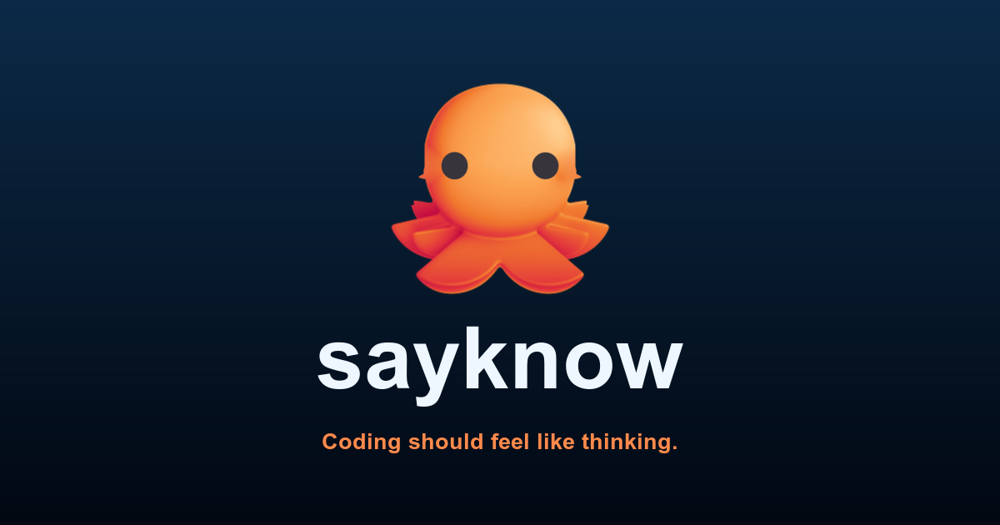

<p align="center">
  
</p>

<h1 align="center">Sayknow-CLI</h1>

<p align="center">
  <strong>Coding should feel like thinking.</strong><br />
  A focused coding-agent runner for interviews, reviewed plans, tmux-native execution, and durable verification.
</p>

<p align="center">
  <a href="https://github.com/jaybeyond/Sayknow_CLI/releases"></a>
  <a href="LICENSE"></a>
  <a href="https://github.com/jaybeyond/Sayknow_CLI/stargazers"></a>
  <a href="https://github.com/jaybeyond/Sayknow_CLI/issues"></a>
  <a href="https://bun.sh"></a>
  <a href="#languages"></a>
</p>

<p align="center">
  <b>English</b> ·
  <a href="docs/readme/README.ko.md">한국어</a> ·
  <a href="docs/readme/README.zh.md">中文</a> ·
  <a href="docs/readme/README.ja.md">日本語</a> ·
  <a href="docs/readme/README.es.md">Español</a> ·
  <a href="docs/readme/README.fr.md">Français</a> ·
  <a href="docs/readme/README.de.md">Deutsch</a>
</p>

<p align="center">
  
</p>

> Sayknow-CLI is an experimental, beta-stage project. Expect rough edges and verify outputs before relying on it for important work.

## Languages

The interface is localized into **7 languages** — English, 한국어 (Korean),
中文 (简体 / Simplified Chinese), 日本語 (Japanese), Español (Spanish),
Français (French), and Deutsch (German). It auto-detects your system locale on
first run; switch any time in **Settings → Appearance → Language**, or launch
with e.g. `LANG=ja_JP.UTF-8 skc`. Untranslated strings fall back to English, and
brand/technical names (Claude, OpenAI, MCP, …) stay verbatim across all locales.

## What is Sayknow-CLI?

Sayknow-CLI (`skc`) is an external coding-agent harness. It runs from the repository or worktree you choose, then gives the agent a small, explicit workflow surface:

```text
deep-interview -> ralplan -> ultragoal
                         └─ optional team execution when parallel tmux workers help
```

It is intentionally not a hidden plugin for Codex CLI, Claude Code, OpenCode, or Claw Code. Start `skc` beside those tools when you want structured planning, persistent evidence, tmux-backed workers, or an isolated worktree.

## Install

SKC runs on the [Bun](https://bun.sh) runtime, so install Bun first, then SKC:

```sh
# 1. Install Bun — the skc runtime (skip if you already have bun >= 1.3.14)
curl -fsSL https://bun.sh/install | bash   # Windows: powershell -c "irm bun.sh/install.ps1|iex"

# 2. Install skc, then verify
bun install -g sayknow-cli       # or: npm install -g sayknow-cli
skc --version
```

The package bundles prebuilt native addons for macOS (Intel + Apple Silicon),
Linux (x64/arm64), and Windows (x64), so there is **no Rust toolchain or build
step**. Bun is the one prerequisite: the `skc` launcher runs on Bun and will not
start without it.

### Upgrading

```sh
npm install -g sayknow-cli@latest    # or run `skc update` in your terminal
```

On startup `skc` shows an **Update Available** notice when a newer release exists.
Run `skc update` from your **terminal** (not inside an skc session) to fetch it.

> **Coming from an older source install?** If you installed earlier by cloning the
> repo, switch to the npm build once and updates become one-line from then on:
> ```sh
> rm -f ~/.local/bin/skc           # remove the old source-linked command
> npm install -g sayknow-cli
> ```

## Install from source (development)

For contributing or running unreleased code. Requires [Bun](https://bun.sh) **and**
a [Rust toolchain](https://rustup.rs) (`cargo`); the native addon is compiled locally.

```sh
git clone https://github.com/jaybeyond/Sayknow_CLI.git
cd Sayknow_CLI
bun install
bun run build:native              # compiles @sayknow-cli/natives (~1 min)
bun run install:dev               # links skc into ~/.local/bin + default skills
skc --version
```

Update a source checkout with `git pull && bun run build:native`. If `skc` is
"command not found", ensure `~/.local/bin` is on your `PATH`
(`echo 'export PATH="$HOME/.local/bin:$PATH"' >> ~/.zshrc && exec $SHELL`).

### Windows (native install)

On a clean Windows 11 machine, install Bun first, then build from source:

```powershell
# 1. Install Bun
powershell -c "irm bun.sh/install.ps1|iex"

# 2. Restart the terminal so PATH and the Bun runtime refresh, then confirm Bun
bun --version

# 3. Clone, bootstrap, and verify skc
git clone https://github.com/jaybeyond/Sayknow_CLI.git
cd Sayknow_CLI
bun run install:dev
skc --version
skc --smoke-test
```

`dev:link` places the `skc` launcher on your `PATH`. That directory must be on
`PATH` for `skc` to resolve as a command — restart PowerShell (or sign out/in)
if `skc` is "not recognized" after install.

Troubleshooting:

- **`skc` reports an old Bun runtime.** Re-run the Bun installer above, restart
  the terminal, and confirm `bun --version` matches what `skc --version`
  expects. If an older Bun still wins, make sure `%USERPROFILE%\.bun\bin` is
  first on `PATH` and remove any stale Bun installs shadowing it.
- **`skc.exe` exists but `skc` is "not recognized".** The launcher is installed
  but not on `PATH`. Confirm `%USERPROFILE%\.bun\bin` is listed in
  `echo $env:Path`, then restart the terminal.

## Quick start

```sh
# Run directly in the current checkout
skc

# Use a tmux-backed leader session
skc --tmux

# Use an isolated worktree for risky or reviewable work
# --worktree takes an optional branch-like name, not a filesystem path.
skc --tmux --worktree my-task-branch

# If you already created a worktree directory, launch from that directory instead.
cd ../my-task-worktree && skc --tmux
```

Inside a SKC session, use the public workflow surface:

```text
/skill:deep-interview clarify ambiguous requirements
/skill:ralplan build and critique the implementation plan
skc ultragoal create-goals --brief-file <approved-plan>
skc ultragoal complete-goals
```

Add `skc team ...` only when coordinated tmux workers materially help.

## Core capabilities

- **Interview before guessing**: `deep-interview` turns vague requests into concrete requirements.
- **Plan before mutation**: `ralplan` reviews the approach before code changes.
- **Execute with evidence**: `ultragoal` tracks goals, revisions, checks, and completion evidence.
- **Parallelize when useful**: `team` coordinates tmux-backed workers for larger tasks.
- **Stay external and reviewable**: run from a chosen repo or worktree without patching another agent runtime.

## Workflow surface

Sayknow-CLI ships four default workflow skills:

| Skill            | What it does                                                          |
| ---------------- | --------------------------------------------------------------------- |
| `deep-interview` | Clarifies ambiguous requirements before planning or code changes.     |
| `ralplan`        | Builds and critiques an implementation plan before mutation.          |
| `ultragoal`      | Tracks goals through execution, revision, verification, and evidence. |
| `team`           | Coordinates tmux-backed workers when parallel execution is worth it.  |

And four bundled role agents:

| Agent       | What it does                                       |
| ----------- | -------------------------------------------------- |
| `executor`  | Bounded implementation, fixes, and refactors.      |
| `architect` | Read-only architecture and code-review assessment. |
| `planner`   | Read-only sequencing and acceptance criteria.      |
| `critic`    | Read-only plan critique and actionability review.  |

No sprawling default skill zoo: SKC improves by making this small method better.

## Works beside your existing agent or bot

| Tool or bot | Recommended SKC command | Boundary |
| ----------- | ----------------------- | -------- |
| Codex CLI | `skc --tmux --worktree <name>` or `skc` | `--worktree` names a SKC-managed sibling worktree; for an existing path, `cd` there first. |
| Claude Code | `skc --tmux` or `skc --tmux --worktree <name>` | SKC does not become a Claude Code extension. |
| OpenCode | `skc` or `skc --tmux` | External-runner workflow only today. |
| Claw Code | `skc --tmux --worktree <name>` | SKC does not install into or replace Claw Code. |
| External controller / bot | `skc mcp-serve coordinator` plus `skc setup hermes` for compatible config, or `skc --mode rpc` for a subprocess worker | Any MCP/RPC-capable bot drives SKC through the generic coordinator/RPC contract, not scrollback scraping. |

For generic third-party bot setup and provider-independent smokes, see [`docs/bot-integration.md`](docs/bot-integration.md). For evaluating Aside as an opt-in search/context retrieval sidecar, see [`docs/aside-integration.md`](docs/aside-integration.md). For the readiness classification across MCP, RPC, ACP, and Bridge/HTTPS surfaces, see [`docs/external-control-readiness.md`](docs/external-control-readiness.md). For lower-level protocol details, see [`docs/hermes-mcp-bridge.md`](docs/hermes-mcp-bridge.md), [`docs/rpc.md`](docs/rpc.md), and [`docs/bridge.md`](docs/bridge.md). For the remote operator surfaces roadmap, see [`docs/sayknow-remote.md`](docs/sayknow-remote.md) (web steering wheel) and [`docs/telegram-remote.md`](docs/telegram-remote.md) (Telegram lifecycle button).

## Configuration

Provider retry budgets live in `~/.skc/config.yml`:

```yaml
retry:
  requestMaxRetries: 4
  streamMaxRetries: 100
  maxRetries: 3
  maxDelayMs: 300000
```

`requestMaxRetries` applies before a stream is established. `streamMaxRetries` applies only to replay-safe transient stream failures. Invalid auth, unsupported models/providers, malformed requests, context overflow, user aborts, and permanent quota failures remain fail-fast.

## TUI identity

The default TUI identity is the SKC **blue-octopus** theme — the blue cephalopod mascot — for both dark and light terminals. A warm **red-octopus** variant is also bundled for those who prefer a darker, high-contrast palette. Three additional migration themes — `claude-code`, `codex`, and `opencode` — mirror the look of those tools for easy eye-migration and are selectable from Settings or `/theme`. Explicit user theme settings still win.

### Bundled theme grid

Pick from Settings (`Appearance -> Dark theme` / `Light theme`) or `/theme`.

| Theme | Visual feel | Best fit |
| --- | --- | --- |
| `blue-octopus` | Default SKC identity — blue octopus palette with tentacle-blue accents. | Default for dark and light terminals. |
| `red-octopus` | Warm red octopus variant with strong status contrast. | High-contrast dark alternative. |
| `claude-code` | Claude Code-inspired dark palette with terracotta and pink highlights. | Claude Code muscle memory without leaving SKC. |
| `codex` | Crisp dark blue-gray palette with sharper coding-session contrast. | A Codex-like dark workspace. |
| `opencode` | OpenCode-inspired dark palette with punchier terminal accents. | OpenCode muscle memory in the bundled picker. |

## Development

Install dependencies, build native bindings, and set up local defaults:

```sh
bun install
bun run build:native
bun run install:defaults
```

The `.node` binary for `@sayknow-cli/natives` is gitignored and required before any CLI invocation (`install:defaults`, `dev:link`, tests).

### Canonical: build and link the dev `skc`

To make the global `skc` command run **this checkout's TypeScript source** (hot to every edit, with skills/natives working), link it onto your `PATH`:

```sh
bun install
bun run dev:link
```

`dev:link` symlinks `skc` → `packages/coding-agent/src/cli.ts` into `~/.local/bin` (override with `SKC_DEV_LINK_DIR`), replaces that managed target, warns and fails if another `skc` still shadows it earlier on `PATH`, and runs `--smoke-test` to confirm `@sayknow-cli/natives` loads. Use `bun run install:dev` for the full bootstrap (install + link + `setup defaults`).

Check at any time whether your `skc` has drifted (wrong source, or a compiled binary that can't load skills):

```sh
bun run dev:doctor
```

> Do **not** use the compiled binary for day-to-day development. `bun --cwd=packages/coding-agent run build` produces a standalone `dist/skc`, but a `bun build --compile` binary cannot dynamically load `@sayknow-cli/natives`, so skills fail with `Cannot find module '@sayknow-cli/natives' from '/$bunfs/root/skc'`. Running from source via `dev:link` avoids this. Build the binary only when validating a release.

Run the CLI from source directly without linking:

```sh
bun packages/coding-agent/src/cli.ts --help
```

Default workflow definitions live in source, not committed `.skc` copies:

```text
packages/coding-agent/src/defaults/skc/skills/<name>/SKILL.md
packages/coding-agent/src/prompts/agents/<role>.md
```

For workflow-definition or rebrand-surface changes, run the project gates:

```sh
bun scripts/check-visible-definitions.ts
bun scripts/verify-g002-gates.ts
bun scripts/rebrand-inventory.ts --strict
bun test packages/coding-agent/test/default-skc-definitions.test.ts
```

For a package-by-package map, see [`docs/codebase-overview.md`](docs/codebase-overview.md).

## Contributing

Contributions, bug reports, and release validation are welcome through GitHub Issues and Pull Requests.

## Inspirations and lineage

Sayknow-CLI's default TUI identity is the cephalopod pair: blue-octopus as the default with a warm red-octopus alternate. It also bundles `claude-code`, `codex`, and `opencode` migration themes whose palettes are inspired by those tools so users moving from them get a familiar look. It builds on lessons from a small family of agent harnesses while keeping the public SKC surface intentionally focused. Historical attribution is kept in [`NOTICE.md`](NOTICE.md).

## License

MIT. See [`LICENSE`](LICENSE).

Sayknow-CLI is a rebranded fork of [gajae-code](https://github.com/Yeachan-Heo/gajae-code) (MIT). Upstream's copyright is retained in [`LICENSE`](LICENSE) and its full feature history lives in that project; this repo tracks the fork's own releases and brand.
